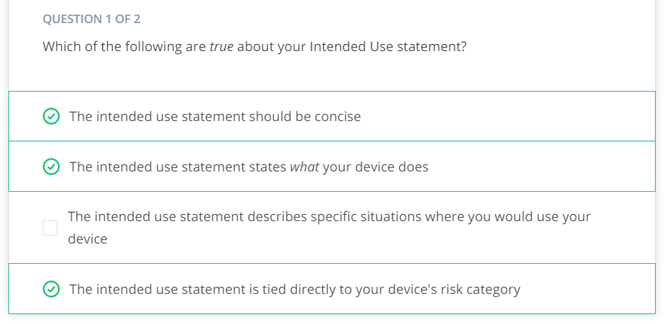
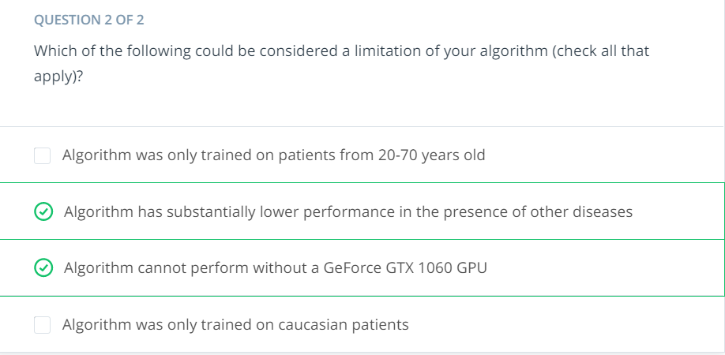
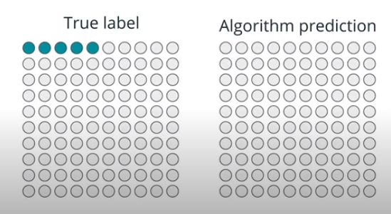
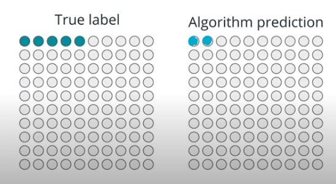
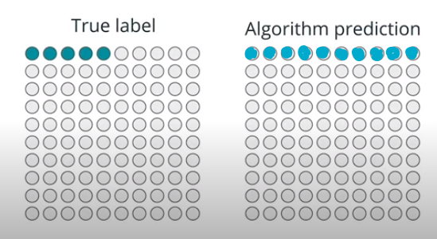

# 2.5 - Translating AI Algorithms for Clinical Settings with the FDA

### 2.5.5




### 2.5.7

A better way to write the intended use statement.

> This algorithm is intended for use on Caucasian, Hispanic, and African American women from the ages of 35-61 who have been administered a screening mammography study on a Hologic mammography machine and have never before demonstrated an abnormal mammography study.


### 2.5.9




### 2.5.12

From Lesson 1

**Specificity**: TN / (TN + FP)  
Proportion of accurately identified negative cases

Let's think about this.  
Specificity is higher when False Positives are lower.  
So a high specificity means that, if the algorithm predicts a positive result, we are very sure that is a real positive...


**Sensitivity (recall)**: TP / (TP + FN)  
Proportion of accurately identified positive cases  
Also commonly referred as **true positive rate** or **recall**.  

Let's think about this.  
Recall is higher when False Negatives are lower.  
So a high recall means that, if the algorithm predicts a negative result, we are very sure that is a real negative...


**Precision**: TP / (TP + FP)  
From all the positives that I say, just trust this percentage  
Also commonly referred as **positive predictive value**

Let's think about this.  
Recall is higher when False Negatives are lower.  
So a high recall means that, if the algorithm predicts a positive result, we are very sure that is a real positive...

High precision -> more confidence in a positive result.  
Application: confirming a diagnosis.


**Example 1**

This is just an extreme example to see that accuracy is not the best indicator.    
This algorithm is useless, but the accuracy is 95%.  



```
[[95, 0],
[5, 0]]
```

* Accuracy: `(95+0)/(95+0+5+0) = 0.95`  
* Specificity: `95/(95+0) = 1.0`  
* Recall: `0/(0+5) = 0.0`  
* Precision: `0/(0+0) = ERROR`  


**Example 2**



```
[[95, 0],
[3, 2]]
```

* Accuracy: `(95+2)/(95+0+3+2) = 0.97`  
* Specificity: `95/(95+0) = 1.0`  
* Recall: `2/(2+3) = 0.4`  
* Precision: `2/(2+0) = 1.0`  

The recall is very low, so we should not rely on this algorithm for detecting positives.    
Nonetheless, both specificity and precision are perfect. This indicates that, if we get a negative, we are very very confident that it's a true negative.  

So, this is a useful algorithm, even when the recall is not high.  
Application: confirming a diagnosis.


**Example 2**


```
[[95, 0],
[3, 2]]
```

* Accuracy: `(95+2)/(95+0+3+2) = 0.97`  
* Specificity: `95/(95+0) = 1.0`  
* Recall: `2/(2+3) = 0.4`  
* Precision: `2/(2+0) = 1.0`

The recall is very low, so we should not rely on this algorithm for detecting positives.  
Nonetheless, both specificity and precision are perfect. This indicates that, if we get a negative, we are very very confident that it's a true negative.

So, this is a useful algorithm, even when the recall is not high.  
Application: confirming a diagnosis.


**Example 3**



```
[[90, 5],
[0, 5]]
```

* Accuracy: `(90+5)/(90+5+0+5) = 0.95`  
* Specificity: `90/(90+5) = 0.947`  
* Recall: `5/(5+0) = 1.0`  
* Precision: `5/(5+5) = 0.5`  

The precision is low, so we should not rely on this algorithm for detecting negatives.  
Nonetheless, recall is perfect. This indicates that, if we get a positive, we are very very confident that it's a true positive.

So, this is a useful algorithm, even when the precision is not high.  
Application: screening studies.


**TODO**: Threshold and recall/precision relationship  
**TODO**: F1 score


### 2.5.13

The accuracy is just useful when the disease has 50% prevalence (which is rare).  


